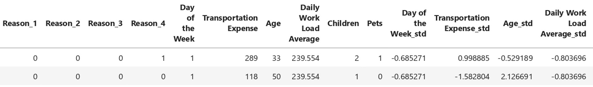

# Machine Learning Project Using Logistic Regression to Predict Absenteeism

## Project Description

**Problem :**  
Absenteeism of workers refers to the habitual pattern of absence from work, often without any valid reason. It can be a significant challenge for organizations as it can disrupt workflow, reduce productivity, and impact overall team morale. Understanding the reasons behind absenteeism is crucial for developing effective strategies to address and mitigate this issue.

**Challenges :**  
Build a machine learning model that can predict the causes of absenteeism

## Project Goal

By understanding the root causes and implementing targeted strategies, organizations can work towards creating a healthier and more productive work environment.

## Tools & Library Used

 &nbsp;
 &nbsp;

## Project Result

[Click here to get full code](https://github.com/nickenshidqia/Predict_Worker_Absenteeism_using_Logistic_Regresssion/blob/4810e46071ce862a8ca0316c45cc26b7d86f433f/Absenteeism.ipynb)

### A. Data Preprocessing

**Description of Dataset:**  

- Dependent variable (target) = Absenteeism Time in Hours
- Independent variable = all columns except target

**Reason for Absence**

- Reason for Absence in this dataset is number, but actually this number represent someone reason to not going to work, example no. 1 is for certain infectious, no. 2 is mental disorder, until no. 28 (max unique value). So it is actually **categorical data**.
- Reason for Absence **do not** have numeric meaning
- Reason for Absence is **categorical nominal**, It means that the order for this variable is not important.
- We need to convert categorical data to numeric one ==> use **One hot encoding**

**Group the Reasons for Absence**

- Grouping 'reason_columns' == Classification
- Classification : re-organizing a certain type of variables into groups in regression analysis
- Reason_1 ==> 1 - 14 according to diseases
- Reason_2 ==> 15 - 17 according to pregnancy
- Reason_3 ==> 18 - 21 according to poisoning
- Reason_4 ==> 22 - 28 according to light reasons for absence

**Transportation Expense**

- Travel expenses are costs related to business travel
- Travel expenses = fuel + parking + meals + transportation + other
- 'Transportation Expense' is subcategory of travel expenses
- 'Transportation Expense' in this dataset is monthly transportation expenses of an individual, measured in dollars.

**Distance to Work**

- The kilometers an individual must travel from home to work

**Daily Work Load Average**

- The average amount of time spent working per day, shown in minutes

**Body Mass Index**

- Indicator for under, normal, overweight person

**'Education', 'Children', 'Pets'**

- 'Education' is categorical data that containing integers. It doesn't have any numerical meaning
- 'Education' needs to convert into dummy variable
- 'Children', 'Pets' are how many kids or pets a person had precisely
- Interpretation of Education :  
  1 = high school  
   2 = graduate  
   3 = post graduate  
   4 = master / doctor  
   Because Education is ordinal (There are levels of education), so we need to transform it to Label Encoding.

### B. Logistic Regression

- Logistic Regression is type of classification
- We create 2 class ==> Moderately absent, Excessively absent
- We'll take the median value of Absenteeism Time in Hours, and use it as cut-off line
- Absenteeism Time in Hours < Median ==> Moderately absent
- Absenteeism Time in Hours > Median ==> Excessively absent

 

- There are 46% of target 1 (Absenteeism Time > 3 hours)
- A balance of 45-55 is almost always sufficient

**Standardize the data**  
Standardize numerical data using StandardScaler

**Logistic Regression**  
 

**A feature is not particularly important :**

- if its coefficient is around 0 & its odds ratio is around 1
- A weight (coefficient) of 0 implies that no matter the feature value, we will multiply it by 0 (in the model)
- For a unit change in the standardized feature, the odds increase by a multiple equal to the odds ratio (1 = no change)
- Example odds x odds_ratio = new_odds ==> 5:1 x 1 = 5:1 (no change)

**The variable that has its coefficient is around 0 & its odds ratio is around 1** ==> USELESS for our model:

- Education
- Month Value
- Distance to Work
- Body Mass Index

  Pet is at the bottom of the table, but their weights are still far away from 0, it's indeed important.  
  Pet is continous variable, that has negative coefficient (-0.352381). Its odds is (1 - 0.703012)\*100 = 29.6% lower than the base model(no pet)

**Interpreting the coefficient :**  
The further away from 0 a coefficient is, the bigger its importance
The highest odds_ratio that affect Absenteeism are :

- Reason 3 (poisoning)
- Reason 1 (diseases)
- Reason 4 (light reasons for absence)
- Reason 2 (pregnancy)

So, the most crucial for excessive absence is positioning. The odds of someone being excessively absent after being poisoned is 20 times higher than when no reason was reported (Reason 0 ==> Baseline model)

**Accuracy of the model:**  
After drop weak variable :  
   
 Based on the data we used, our model learned to classify 75.40% of the observation correctly
